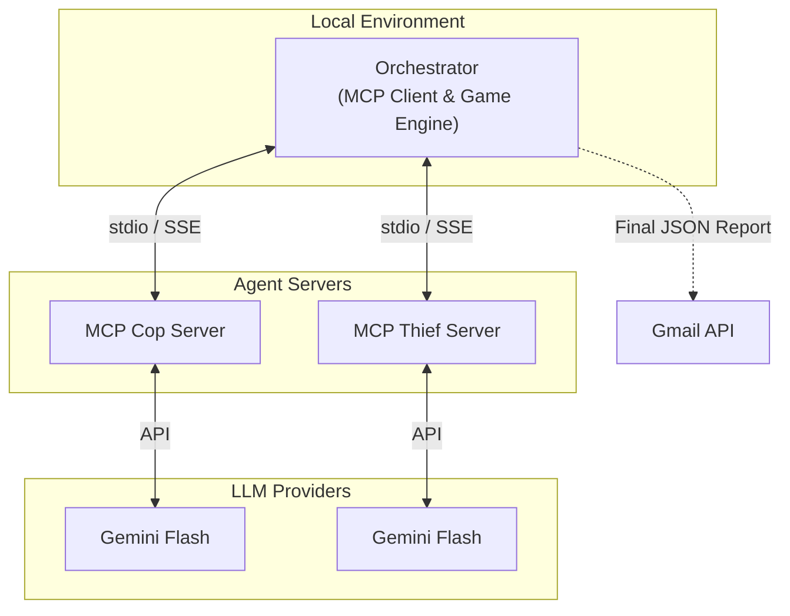

# 🚔 Cops and Robbers: Dual AI Multi-Agent MCP Ecosystem

**Qusai Amara & Ameer Mtanis** — Group: Amara-Mtanis

## Overview
This repository implements **Assignment 6: Cops and Robbers chase between autonomous agents in a partially observable environment using MCP servers**.

## 🧠 Dec-POMDP Formulation
The problem is strictly modeled as a **Decentralized Partially Observable Markov Decision Process (Dec-POMDP)**:

$\langle n, S, \{A_i\}, P, R, \{\Omega_i\}, O, \gamma \rangle$

- **$n$**: Number of agents (2: Cop and Thief)
- **$S$**: State space (Physical grid coordinates of Cop, Thief, and Barriers).
- **$A_i$**: Action space (Movement: 8-directional or wait. Cop can also place up to 5 barriers).
- **$P$**: State transition probability function (Deterministic unless collision occurs).
- **$R$**: Reward function (Cop Win: 20 pts, Thief Loss: 5 pts | Thief Win: 10 pts, Cop Loss: 5 pts).
- **$\Omega_i$**: Observation space (Radius-2 Chebyshev Distance partial observability).
- **$O$**: Observation probability function (Agents only receive opponent location if they are within a radius of 2. Otherwise, location is "unknown").
- **$\gamma$**: Discount factor.

## 🏗️ Architecture Design
The architecture uses the **Model Context Protocol (MCP)** via the `fastmcp` SDK to completely isolate the agents from the game engine.



## 🤖 Agent Intelligence

### Chain-of-Thought Reasoning
Both agents output a `"thought"` field in their JSON response before deciding on an action. This forces the LLM to reason strategically about the game state before committing to a move.

### Move History Context
The orchestrator injects the **last 5 moves** into each observation, giving the agents temporal awareness to predict opponent patterns and adapt their strategies.

### Cop Strategy
- **Pursuit**: Moves directly to the Thief's position when adjacent.
- **Barrier Placement**: Strategically places barriers to cut off escape routes when the Thief is within sight radius.
- **Sweep Pattern**: Systematically searches the grid when the Thief is out of observation range.

### Thief Strategy
- **Evasion**: Flees in the opposite direction when the Cop is adjacent.
- **Center Bias**: Stays near the grid center to maximize escape options.
- **Corner Avoidance**: Avoids corners and edges that limit movement.

## 🚀 How to Run (Local Stdio Mode)
By default, the orchestrator acts as an MCP client and securely spins up the servers via local subprocesses (stdio transport).
1. Clone the repo.
2. Provide your API key in a `.env` file: `GEMINI_API_KEY=your_key_here`
3. Install requirements: `pip install -r requirements.txt`
4. Run the 6-game series:
   ```bash
   python orchestrator.py
   ```

## ☁️ How to Run (Cloud/SSE Mode for Inter-Group Battles)
For the inter-group battle, the servers can be exposed via SSE and accessed by a remote orchestrator.
1. Spin up the Cop server on SSE transport:
   ```bash
   python mcp_server_cop.py --sse
   ```
2. Expose the port (5000) using `ngrok` or `localtonet`:
   ```bash
   ngrok http 5000
   ```
3. Update `config.json` on the opposing team's machine to point to your ngrok URL:
   ```json
   "cop_mcp_url": "https://your-ngrok-url/sse"
   ```
4. When the opposing team runs their `orchestrator.py`, it will dynamically connect to your remote MCP server via HTTP Server-Sent Events (SSE) and query your LLM for moves!

## 📊 Automated Reporting
The system features an automated report dispatcher (`report_sender.py`). Once the 6 sub-game pipeline concludes, it generates a comprehensive JSON report containing all trajectories, messages, and cumulative scores, and dispatches it directly to `rmisegal+uoh26b@gmail.com`.

## 📈 Visualization
A web-based visualizer is included in the `visualizer/` directory. After running the orchestrator:
```bash
cd visualizer
python -m http.server 8000
```
Then open `http://localhost:8000` to replay the games turn-by-turn with an interactive grid view.
